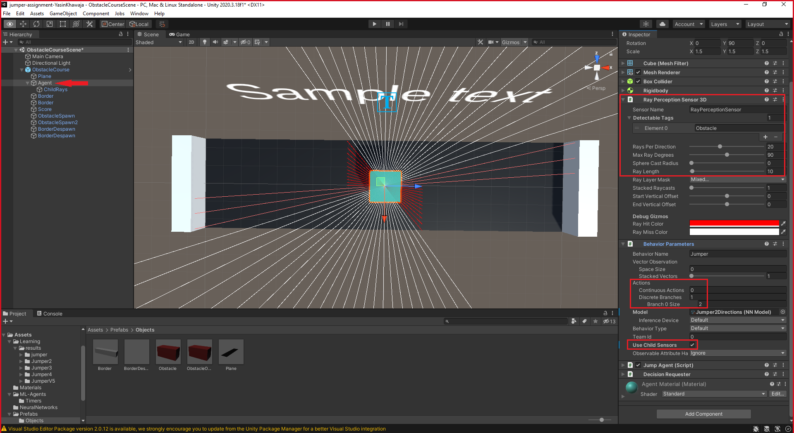
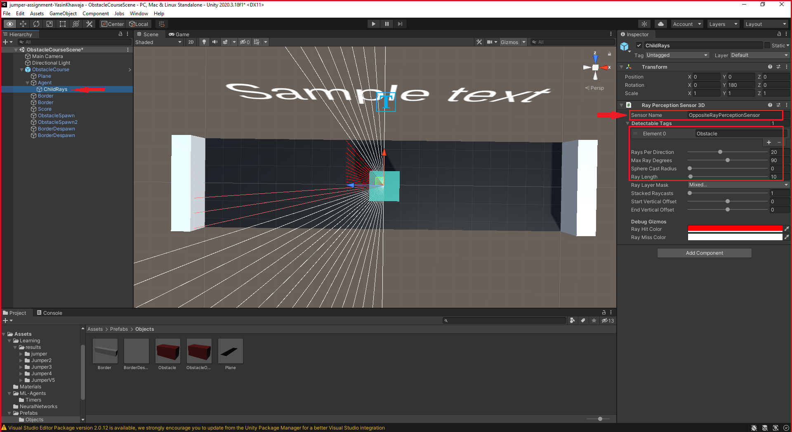

# Jumper - The Unit
## Inleiding
Er wordt een *agent* getraind om over obstakels te springen.

### Scenario 1
Voor de 1<sup>ste</sup> scenario hebben we gekozen voor de **1<sup>ste</sup>** functionaliteit bij de opdrachtomschrijving, namelijk dat de *agent* geconfronteerd wordt met een rij van continu bewegende obstakels en over deze moet springen. Deze is onze originele opdracht.

### Scenario 2
Als <ins>extra</ins> scenario hebben we gekozen voor de **4<sup>de</sup>** functionaliteit bij de opdrachtomschrijving, namelijk dat de *agent* op het midden van een platform staat en obstakels moet ontwijken, die vanuit twee richtingen komen, door er over te springen.

## Observaties
De *agent* kan de omgeving observeren met *rays*, of stralen. Dit wordt gedaan door aan de *agent* de *Ray Perception Sensor 3D*-component te geven. 
Deze component geeft de *agent* ogen, in de vorm van stralen, en geeft de mogelijkheid om zijn 3D-omgeving te verkennen door middel van *raycasting*.




## Acties
Om obstakels te kunnen ontwijken, moet de *agent* kunnen springen. Hierdoor heeft de *agent* maar twee mogelijke acties.

* Stilstaan
* 1 verticale actie: springen.

Om de *agent* te kunnen laten springen, gebruiken we de *Rigidbody*-component. Met deze component, kan een object reageren op fysica. Deze component is ook best gebruikt met een *Collider*-component, in dit geval een *Box Collider*, om botsingen te detecteren.  
Wij gebruiken de *Rigidbody* om aan de *agent* een verticale kracht te geven die vervolgens met zwaartekracht terug naar beneden valt.

## Beloning
Tijdens het leerproces, moet de *agent* weten of die goed aan het presteren is of niet. Dit wordt verwezenlijkt door een beloningssysteem.

* Wij belonen de *agent* met **+1** als die over een obstakel kan springen.
* Als de *agent* niet over een obstakel kan springen en erop landt, krijgt die een straf van **-1**.
* Ook krijgt de *agent* een klein strafje van **-0.01** als die voor niets springt.

## Spelverloop
Het spel bestaat uit een aantal componenten. De *flow* van het spel is dat er continu objecten vanuit 1 richting komen op verschillende tijdsintervallen en snelheden, hierover moet de *agent* springen. We probeerden dit hierna uit te bereiden naar 2 richtingen, de documentatie daarvoor wordt ook uitgelegd maar is mislukt tijdens de *training*-fase.
### ObstacleCourse
*ObstacleCourse* is een empty *parent* object dat als *children* alle *Game Objecten* bevat voor het *jumper* scenario.
#### ObstacleCourse.cs
Dit object bevat ook een script, met dit script zullen we objecten instantiëren.
* De inputs hiervan zijn als volgt:
```{r}
    // Default obstacle
    public GameObject obstacle;
    
    // Obstacle that spawns at the second location
    public GameObject obstacleOpposite;
    
    // Spawner for default obstacle
    public GameObject obstacleSpawner1;
    
    // Spawner for obstacle in the second location
    public GameObject obstacleSpawner2;
    
    // Bool to check if obstacles are allowed to spawn
    private bool spawn = true;
    
    // Activates/deactivates the second spawn
    [SerializeField]
    private bool secondSpawner = false;
```
* OnEnable():
Verder is er een *OnEnable* methode, wanneer de code actief is zal deze de *Spawner* methode starten. Het nut hiervan is dat we deze routine kunnen stoppen indien nodig met *StopCoroutine()*.
```{r}
private void OnEnable()
    {
        StartCoroutine(Spawner());
    }
```
* Spawner():
De *Spawner* methode bevat de random tijdintervallen waarop een object geladen wordt, indien *secondSpawner* enabled is zal deze ook een tweede object laden met een nieuw tijdsinterval. Deze objecten blijven laden totdat de *spawn* bool op *false* komt te staan, dit gebeurt later in *ClearEnvironment()*.
```{r}
    private IEnumerator Spawner()
    {
        while (spawn)
        {
            var waitTime = Random.Range(3f, 5f);
            yield return new WaitForSeconds(waitTime);
            SpawnObstacle();
            if (secondSpawner)
            {
                waitTime = Random.Range(3f, 5f);
                yield return new WaitForSeconds(waitTime);
                SpawnObstacleOpposite();
            }
        }
    }
```
* SpawnObstacle en SpawnObstacleOpposite:
Zijn bijna identieke methoden, ze instantiëren een nieuw obstakel object onder een bepaalde *parent*. Deze *parents* zijn de *ObstacleSpawn* objecten, de obstakels zullen 8 *units* verwijderd zijn van het object.
```{r}
private void SpawnObstacle()
    {
        GameObject newObstacle = Instantiate(obstacle.gameObject);
        newObstacle.transform.SetParent(obstacleSpawner1.transform);
        newObstacle.transform.localPosition = new Vector3(1.5f, 0.5f, -8);
    }

    private void SpawnObstacleOpposite()
    {
        GameObject newObstacle = Instantiate(obstacleOpposite.gameObject);
        newObstacle.transform.SetParent(obstacleSpawner2.transform);
        newObstacle.transform.localPosition = new Vector3(1.5f, 0.5f, -8);
    }
```
* ClearEnvironment.cs:
Deze methode staat publiek en kan dus door andere klassen opgeroepen worden. Het zal tijdelijk de spawner uitschakelen en alle obstakels verwijderen van de omgeving. Dit wordt aangeroepen indien we de *environment* willen herstarten.
```{r}
    public void ClearEnvironment()
    {
        spawn = false;
        foreach (Transform obstacle in obstacleSpawner1.transform)
        {
            GameObject.Destroy(obstacle.gameObject);
        }
        foreach (Transform obstacle in obstacleSpawner2.transform)
        {
            GameObject.Destroy(obstacle.gameObject);
        }
        spawn = true;
    }
```
### Plane
Hierop staat alles geplaatst, het heeft niet veel nut buiten dat objecten hierop staan en bewegen.
### Agent
Dit is de speler & AI, het heeft een collider indien deze een obstakel raakt. Dit object bevat de *Ray Perception Sensors, Behavior Parameters, Agent en Decision Requester*. Verder heeft het ook een child-object met *Perception Sensors* aan de tegenovergestelde kant, de reden voor deze keuze was indien we de rays aan een van de kanten wouden verkleinen of niet. Dit heeft momenteel geen nut en mag vervangen worden door 1 parent-object met een *Ray Perception Sensors-component* dat 360 graden rondom het object kijkt.
#### JumpAgent.cs
Dit is het *agent* script dat we gebuiken, hier wordt alle logica voor het neurale netwerk in uitgewerkt dat met behulp van *ML-Agents* getraind en aangemaakt wordt.
* Hiervoor zijn bepaalde inputs nodig:
```{r}
    // De snelheid/kracht van een sprong
    [SerializeField]
    private float jumpSpeed = 3f;
    
    // Het scorebord waarop we de cumulatieve beloning tonen van de agent
    [SerializeField]
    private TextMeshPro score;
    
    // Een referentie naar het script waarmee we objecten gaan instantiëren 
    private ObstacleCourse obstacleCourse;
    
    // Een referentie naar het Rigidbody component van de agent, dit gebruiken we later om de agent te laten springen
    private Rigidbody m_Rigidbody;
    
    // Deze bool zal gebruikt worden zodat je niet oneindig lang kunt springen
    private bool jump = true;
```
* Start():
Deze methode wordt automatisch opgeroepen bij het opstarten, hierin zoeken we voor het *Rigidbody* component dat de *agent* bevat alsook de referentie naar het script van het *ObstacleCoruse*. Deze componenten hebben we later nodig.
```{r}
    void Start()
    {
        m_Rigidbody = GetComponent<Rigidbody>();
        obstacleCourse = GetComponentInParent<ObstacleCourse>();
    }
```
* Update():
De update methode zal automatisch de cumulatieve beloning van de agent in het scorebord (*TextMeshPro*-object) tonen.
```{r}
    void Update()
    {
        score.text = GetCumulativeReward().ToString("f4");
    }
```
* OnEpisodeBegin():
Bij het begin van de training wordt heel de environment leeg gemaakt en gestart. Ook wordt er zeker gemaakt dat de kubus op de juiste locatie staat en juist geroteerd is voor de *Ray Perception Sensors* en/of beweging op de x-, z-as indien nodig.
```{r}
    public override void OnEpisodeBegin()
    {
        obstacleCourse.ClearEnvironment();
        transform.localPosition = new Vector3(0, 0.75f, 0);
        transform.localRotation = Quaternion.Euler(0, 90, 0f);
    }
```
* OnActionReceived(ActionBuffers actions):
Hierin definiëren we dat actie[0] een sprong is, hiervoor roepen we de *Jump()*-methode op. Om te vermijden dat de agent blijft springen zetten we hier een kleine negatieve beloning op.
```{r}
    {
        var action = actions.DiscreteActions;
        if (action[0] == 1)
        {
            AddReward(-0.01f);
            Jump();
        }
    }
```
* Heuristic(in ActionBuffers actions):
De *heuristic* controle om manuele input te verwerken, wanneer er op spatie wordt geduwt zal onze actie op 1 worden gezet, zoals gedefinieerd in *OnActionReceived* is dit gelijk aan een sprong.
```{r}
    {
        var jump = 0;
        if (Input.GetKey(KeyCode.Space))
        {
            jump = 1;
        }
        var discreteActionsOut = actionsOut.DiscreteActions;
        discreteActionsOut[0] = jump;
    }
```
* Jump():
Deze methode bevat de manier waarop we een sprong maken, als de bool *jump* op *true* staat kunnen we springen, dit wordt in de volgende methode verduidelijkt. Indien de *agent* mag springen oefenen we een vertikale kracht uit op ons object. Dit zal gebruik maken van de *float jumpSpeed* die we eerder hebben bepaald. We willen dat de kracht altijd even groot is dus voegen we *Forcemode.VelocityChange* toe aangezien dit de massa van het object negeert bij het toevoegen van de snelheid/kracht. Hierna zetten we de *jump* bool op *false*.
```{r}
    private void Jump()
    {
        if (this.jump)
        {
            m_Rigidbody.AddForce(new Vector3(0, jumpSpeed, 0), ForceMode.VelocityChange);
            this.jump = false;
        }
    }
```
* OnCollisonEnter(Collision collision):
Dit is de methode waarmee we kijken of het object terug mag springen of niet. We willen niet dat wanneer de *agent* springt deze oneinidig hoog kan gaan door te blijven springen. Dus zetten we in de vorige *Jump()* methode de restrictie dat wanneer de agent springt deze niet meer mag springen. In de *OnCollisionEnter* die dus wordt opgeroepen wanneer het object (*agent*) met een object in aanraking komt, definiëren we dat de *jump* bool op *true* mag gezet worden indien hij in aanraking komt met de grond (*plane*). Hierdoor kan de *agent* dus enkel springen wanneer deze land. Verder kijken we ook of de aanraking misschien een obstakel was, indien dit het geval is wordt het obstakel vernietigt en krijgt de agent een negatieve beloning van -1 aangezien we willen dat de agent hier over springt. Hier kunnen we ook een episode in eindigen indien nodig en herstarten met de *ClearEnvironment()* methode.
```{r}
    {
        if (collision.transform.CompareTag("Plane"))
        {
            this.jump = true;
        }
        else if (collision.transform.CompareTag("Obstacle"))
        {
            Destroy(collision.gameObject);
            AddReward(-1f);
        }
    }
```
### Borders
Er zijn 2 borders, deze waren initieel voor een collision detectie. Dit is uiteindelijk verandert en zijn nu puur aesthetisch.
### Score (TextMeshPro)
Dit is het scorebord dat bijhoud hoeveel punten de agent behaald, dit houdt dus de cummulatieve beloning van de agent bij.
### ObsactleSpawn
* ObstacleSpawn: Dit is de eerste spawner die als referentie dient om de *Obstacles* in een positieve x waarde te laden met een Y-rotatie van -90°.
* ObstacleSpawn2: Dit is de tweede spawner die als referentie dient om de *OppositeObstacles* in een negatieve x waarde te laden met een Y-rotatie van 90°.
### BorderDespawn
Beide *BorderDespawn* objecten hebben geen *Mesh Renderer*, hun nut is om de objecten die voorbij de agent zijn geraakt te vernietigen. Dit gebeurt aan de hand van een *OnColission* script dat de obstakels hebben, hier later meer over.  
### Obstakels
Dit zijn de objecten die geinstantieerd worden en naar de *agent* toe gaan. Er zijn twee soorten obstakels namelijk *Obstacle* en *ObstacleOpposite* aangezien deze op andere locaties geladen worden en elks een eigen script hebben dat momenteel identiek is aan elkaar. Toch hebben we dit onderscheiden in het geval dat we een van de twee obstakel types anders wouden zoals een andere willekeurige snelheid of dergelijke. Aangezien deze momenteel identiek zijn wordt er maar 1 van de scripts uitgelegd.
#### ObstacleRandomSpeed.cs
Dit script dient vooral om een obstakel een willekeurige snelheid te geven.
* Hiervoor hebben we de volgende inputs nodig:
```{r}
    // Standaard obstakel snelheid, deze kan aangepast worden. Wordt momenteel niet gebruikt aangezien we een willekeurige snelheid kiezen
    [SerializeField]
    private float _obstacleSpeed = 4.5f;
    
    // Standaard waarde of er een willekeurige snelheid gebruikt moet worden, deze wordt aangezet in het unity project maar staat standaard op *false*
    [SerializeField]
    private bool randomSpeed = false;
    
    // Referentie naar de script van de agent
    private JumpAgent agent;
```
* Start()
Hierin zoeken we naar de *agent* zijn *agent* component in dit geval is dit van het type *JumpAgent* dit hebben we nodig om later een beloning aan de agent toe te wijzen. Verder bepalen we de willekeurige snelheid indien nodig, dus wanneer de *randomSpeed* waarde *true* is. Let op dit zijn int waarden en geen float waarde dus is de willekeurige waarde 4 of 5, als dit een float waarde was telt de *upper bound* wel mee dus 4f, 6f geeft een *float* waarde tussen 4f en 6f weer.
```{r}
void Start()
    {
        agent = GameObject.Find("Agent").GetComponent<JumpAgent>();
        if (randomSpeed)
        {
            _obstacleSpeed = Random.Range(4, 6);
        }
    }
```
* Update()
De *Update* methode gebruiken we om het obstakel te laten bewegen, het is een lokale positie dus zal de beweging afhangen van de rotatie van het object. Deze rotatie werd op voorhand bepaalt door de *ObcstacleSpawner* in een bepaalde rotatie te plaatsen. In dit project zal het een positieve waarde op z-as nodig hebben om richting de kubus te bewegen, dit is ook het geval voor *ObstacleOppositeRandomSpeed* aangezien de spawner daar in de tegenovergestelde richting is geroteerd.
```{r}
    void Update()
    {
        transform.localPosition += new Vector3(0, 0, _obstacleSpeed * Time.deltaTime);
    }
```
* OnCollisonEnter(Collision collision)
Het object kan met de *agent* of een *border* in aanraking komen, indien de speler het object raakt wordt het vernietigt zoals we in de *JumpAgent* klasse zagen. Indien het obstakel in aanraking komt met een *border*, dit zijn de onzichtbare objecten dat achter de kubus staan, zal het obstakel vernietigt worden en krijgt de *agent* 1 bonus punt. Aangezien een obstakel enkel en alleen bij een *border* kan geraken als de agent succesvol over het object heen heeft gesprongen.
```{r}
    private void OnCollisionEnter(Collision collision)
    {
        if (collision.transform.CompareTag("Border"))
        {
            agent.AddReward(1f);
            Destroy(this.gameObject);
        }
    }
```  
## Configuratie
SANDER?

## Resultaten
* Scenario 1: De *agent* die we trainden om over een blokje dat constant vanuit dezelfde richting met verschillende snelheden aankomt te springen (scenario 1), is gelukt in ongeveer **1 miljoen** stappen. Dit was de originele opdracht, als extra hebben we obstakels vanuit beide richtingen laten komen.
* Scenario 2: We probeerden de *agent* aan te leren om over een blokje, dat op 1 van de 2 locaties *spawned* met een variabele snelheid, heen te springen. Dit was na **~5.486.000** stappen nog niet gelukt. De *agent* kon niet consisten over beiden blokken heen springen.

De neurale netwerken zijn terug te vinden in *Assets* &rarr; *NeuralNetworks*.
* Het *Jumper1Direction*-brein is voor scenario 1.
* Het *Jumper2Directions*-brein is voor scenario 2.

Hiervoor werd respectievelijk gebruik gemaakt van de *Jumper4* en *JumperV5* folders binnen *Assets* &rarr; *Learning* &rarr; *results*.

## Conclusie
* De agent kon, na 1 miljoen stappen, consistent (6% faal kans) over een obstakel vanuit 1 richting met een variabele snelheid springen. En verkreeg altijd een positieve cumulatieve beloning.
* De agent kon **niet**, na ongeveer 5.486.000 stappen, consistent over een obstakel dat vanuit 2 verschillende richtingen met variabele snelheden springen. Deze kreeg na een langere periode een positieve cumulatieve beloning, maar was niet voldoende om nooit een negatieve cumulatieve beloning te verkrijgen.
